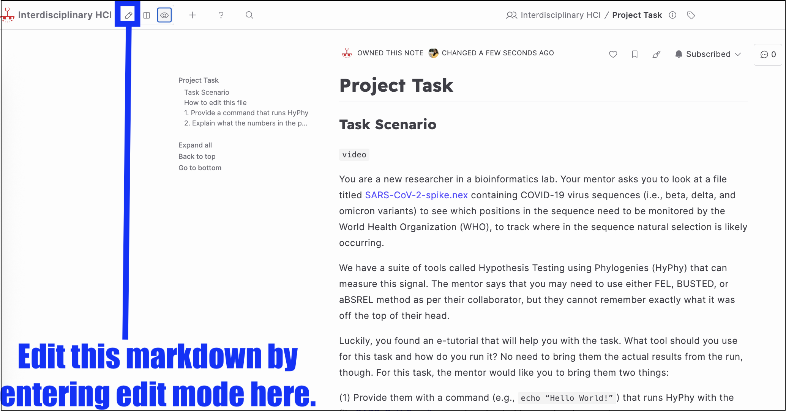
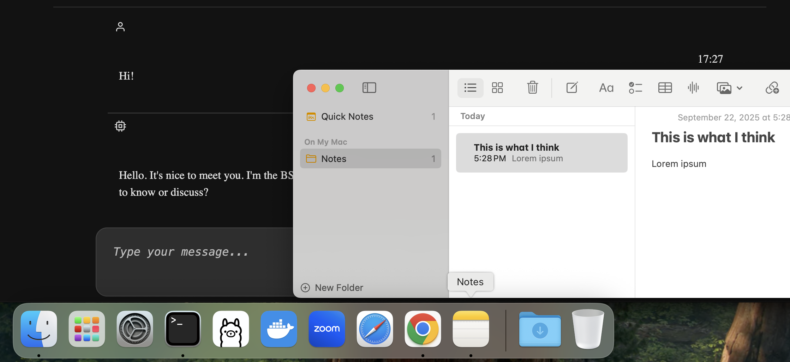

# Project Task

## Task Scenario 

`video` https://youtube.com/shorts/Bnxgrbpujrk

You are a new researcher in a bioinformatics lab. Your mentor asks you to look at a file titled `SARS-CoV-2-spike.nex` https://github.com/veg/hyphy/blob/master/tests/data/SARS-CoV-2-spike.nex containing COVID-19 virus sequences (i.e., beta, delta, and omicron variants) to see which positions in the sequence need to be monitored by the World Health Organization (WHO), to track where in the sequence natural selection is likely occurring. 

We have a suite of tools called Hypothesis Testing using Phylogenies (HyPhy) that can measure this signal. The mentor says  that you may need to use either FEL, BUSTED, or aBSREL method as per their collaborator, but they cannot immediately remember exactly what it was. They rushed off to a meeting, but you know that you have a 1-on-1 meeting with them coming up in 40 minutes.

Luckily, you found an e-tutorial that will help you with the task. What tool should you use for this task and how do you run it? No need to bring them the actual results from the run, though. For this task, the mentor would appreciate it if you brought them two things: 

(1) Provide them with a command (e.g., `echo “Hello World!”`) that runs HyPhy with the file [`SARS-CoV-2-spike.nex`](https://github.com/veg/hyphy/blob/master/tests/data/SARS-CoV-2-spike.nex) downloaded to your local computer.

(2) Explain what the numbers in the potential output would mean, and why that would matter for what we want to do.

## Additional Instructions

### Write your answers below as you are learning from the e-tutorial. The markdown will autosave.
### Take notes as much as you'd like.
### You can use external online resources as needed. 

----------------

## Write your answer here

### 1. Provide a command that runs HyPhy

`Your answer`

### 2. Explain what the numbers in the potential output would mean, and why that would matter

`Your answer`

----------------

## How-tos 

### How to edit this file

Enter **Edit** mode to edit the file or use **Both** mode.

### How to take notes

Use the Notes app to record notes.

